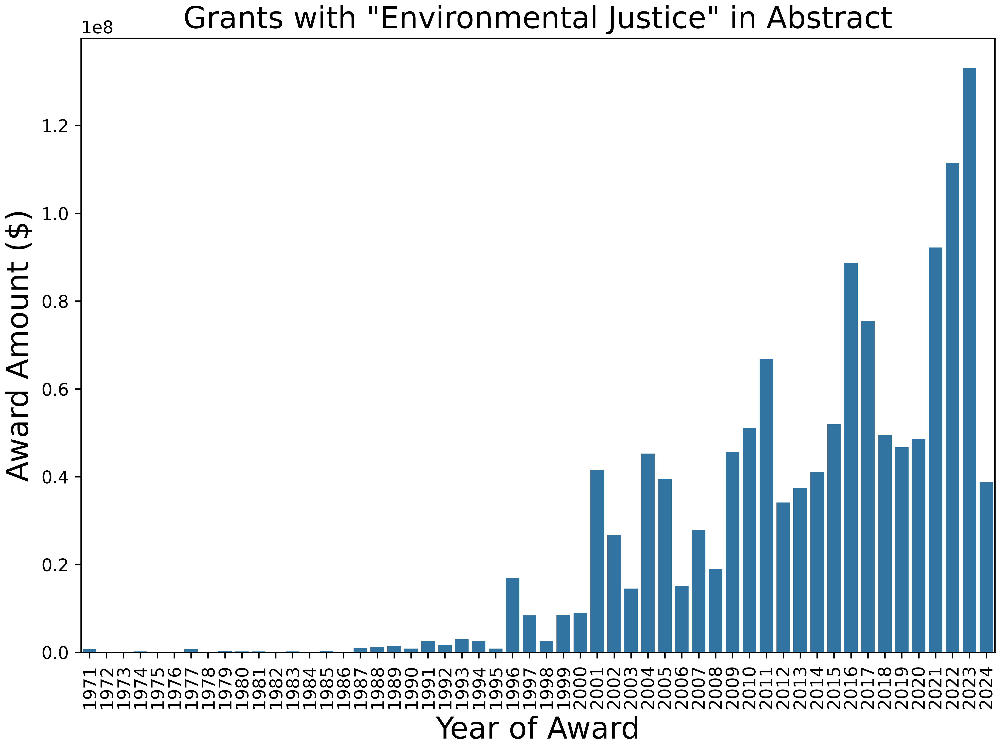
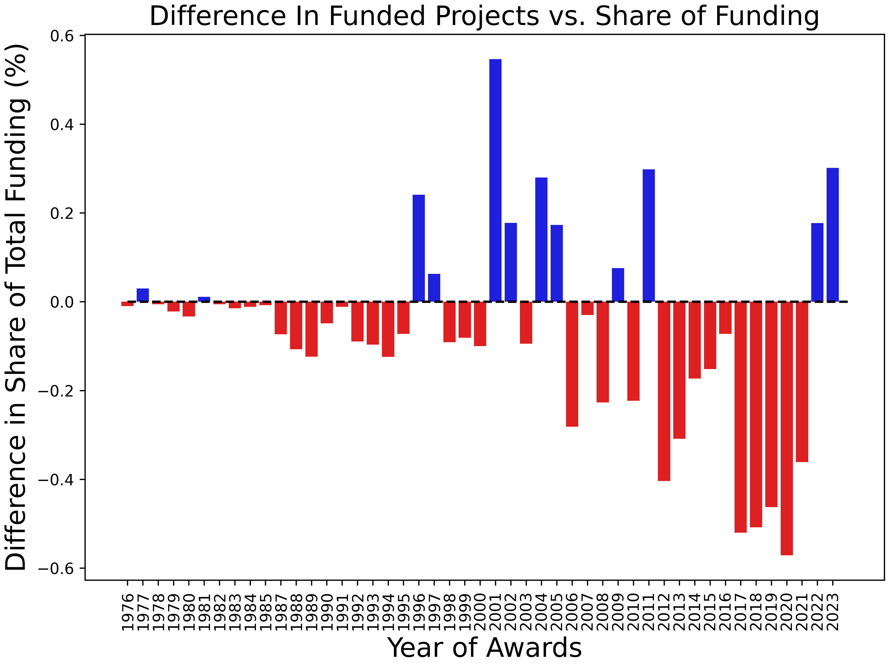

# Group 15 -- Advancing Data Equity for Environmental Justice

# What data equity model and accountability practices advance environmental justice?

### Group Members (alpha order): Jeff Altschul, Nels Bjarke, Jess Logan, Nathan Morrow, Maddy Nyblade, Queen Quet

# Day 3 Report Back

### Interesting Graphic/Finding
 

 

 

 

### Big Questions
- How are the resources actually distributed?
- What does this look like by NSF areas?
- What about other government funding sources and departments?
- What does justice look like with land claims? Co-stewardness, Co-Management
- Is power actually redistributed? How do you evaluate?
- Examples of successful cases. Who is defining "success"? How is success being defined? Are EJ communities included in the definition?
- How do we get to a trusting relationship where trust can define the terms and work together? Trust is not something to be engineered, it is to be earned.
- Who gets to say what the research questions are?

### What’s missing: what resources, people, data sets, etc. does your team need?

**Data**
- Data sets are not appropriate for what is needed. They need more EJ community participation.
- Look at the data through an EJ lens
- How the data is created, stored, and structure needs to be looked at and improved for EJ data. Consider how to be equitable with the data and not exploit the group it is collecting from.
- Apply the [Principles of Environmental Justice](https://ejnet.org/ej/principles.pdf) to the data structure. 
- Empower local and/or marginalized groups to manage their destiny or environmental resources. We need to marshal information that demonstrates if you do that (empower) you get to a better outcome so not just a “good thing” or “morally right”, its scientifically the right thing to do for society at large.

**People & Culture**
- Ground up approach instead of a top-down approach. Adaptation and justice are on the ground
- Work with the EJ experts - like the [Bullard Center](https://www.bullardcenter.org/)
- [Southern Environtmental Law Center](https://www.southernenvironment.org/our-focus/environmental-justice/)
- HCBU's & TCU's
- American Geophysical Union AGU - Thriving Earth Exchange
- Local EJ Voices - build the trust and then grow from there
- Groups writing the calls for funding proposals to learn how to rework the structure to work with the EJ communities appropriately to effectively fund (versus exploit)

**Expectations**
- EJ communities understand what they need but do not have the funding, tools, and/or capacity. Communities can represent thems with directed questions to groups like ESIIL.
- Flip the power dynamic. 
- EJ representatives are looking for tools to take back to their communities to use. How can ESIIL partner with other EJ groups and provide tools and support? Trust can start - I have this tool and provide it to you."

### What are you thinking about doing next with your team? Long-term, short-term?
- Personal Connections
- Long Term - The group has decided it is an important topic. If truly interested in doing the research in it, it would require teasing it out over a longer period of time. Everybody has a different perspective - figure out what is the best approaches to effect change and the process in a positive way. It’s beyond writing an academic paper - its coming up with a new system of making decisions in multiple fields. This is a process 
- Suggest working with [Bullard Center](https://www.bullardcenter.org/) 

### Data Sets:

- NSF grant amounts
- Government Estimates (Federal and State)
- Comanagement 
- Policies of Government Agencies in relation to environmental justice and interaction with communities
- Justice 40 data
- Community engagment contracts 
- Southern Environmental Law Center
- Bullard CEnter for Environmental Justice
- ENvironmental Justice Grants & Technical Assistance under the Inflation Reduction Act (EPA)
- HBCUs
- Existing data sets: Data needs to be extracted, re-framed and strengthened. Put into a model of what needs to be left at the end of the project so the data can still be used in the community it came from.

# Day 2 Report Back

### What worked well for your team?
- Organic way we used our strengths
- Talked in a circular manner
- Working face to face is powerful - distance and zoom would change the dynamic

### What's one thing you would change?
- Don’t change anything after the first day

### Did your group have an Ah-Ha Moment? What led up to that moment?
- Individual Ah-Ha's as we shared around our circle. 
- Nel’s graphs

### Did your group experience the Groan Zone?
- The ESIIL structure for this topic doesn't fit.
- This space does not have the tools, people, or culture to support this topic yet. 
- If ESIIL seriously wants to tackle the topic of environmental justice and equity in data, then partner with the Bullard Center <https://www.bullardcenter.org/>

### One tip to share with future groups about getting through the groan zone
- Sit in a circle and dicuss around the circle

